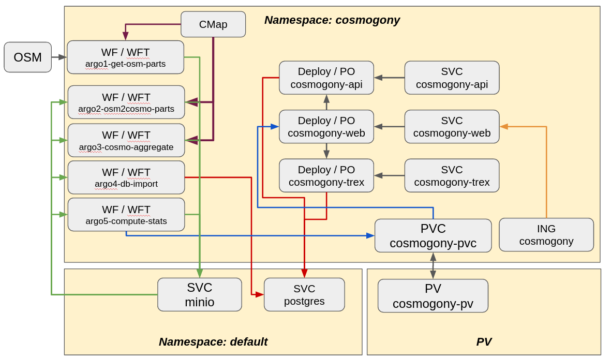

# Cosmogony k8s deployement (WIP)

This repo aims to ease the installation of the Cosmogony full stack (with Dashboard and Data update jobs)
on a Kubernetes cluster.

## Prerequisites
This installation relies on:
- A Kuberetes cluster (version prior to 1.22 because of the Ingress API modification)
- Argo workflow with version >= 2.9 (because of the use of [Workflow Restrictions](https://argoproj.github.io/argo/workflow-requirements/))
- Minio for storing OSM data and processed results
- PostgreSQL (you need to create a database with postgis)

Installation of those components are not included in this repo.

A local Docker Registry is requested for the time being to store the web part images. This should be configure in the `./Makefile` file.

## Global architecture

## Installing this chart
First, you need to build the images and push them to your local registry (part of the images are not pre-built on DockerHub):
- Edit the `Makefile` to setup your registry location
- Run `make init` to checkout github submodules
- Run `make build_importer`
- Run `make build_api`
- Run `make build_web`
- Run `make build_trex`

Next install everything using the helm chart:
- `cp ./cosmo_chart/values.yaml ./myvals.yaml`
- edit the file `myvals.yaml`
- run `helm upgrade --install -f myvals.yaml cosmogony-dev ./cosmo_chart`

Be carefull, PersistentVolumes are created as part of the deployment.

You can run a data update by modifying ./argo_workflow.yml and running:
argo submit argo_workflow.yml

## Desciption of the parts

### Data processing
The processing part is constituated of:
- the `Cosmogony` component in charge of extracting data from OSM (Dockerfile in `cosmogony`)
- an import process that import the cosmogony output in postgres (Dockerfile in `cosmogony_explorer/importer`)
- the dashboard data generator (Dockerfile in `cosmogony-data-dashboard`)

### Front end
The web part is built on top of the PG database and is constituated of:
- a vector tile provider : t-rex (Dockerfile in `cosmogony_explorer/tiles`)
- an api in python/Flask (Dockerfile in `cosmogony_explorer/api`)
- a web server nginx with the web site (Dockerfile in `cosmogony_explorer/explorer`).

Note : the web server is also used as a proxy for:
- the tiles
- the python api
- serving the static file for the dashboard

### Common
This folder contains objets used in both Data processing and Frontend parts.

## Todo
- improve tile rendering (high CPU load for low level)
  - use a PV to persist t-rex tiles
  - add a "cache clean-up" after data update process
  - trigger a "cache preprocess" (idea: use a temp foler then switch folders with actual cache)
- Set a cosmogony concat process in Argo that works
- improve deployement using a Helm Chart

